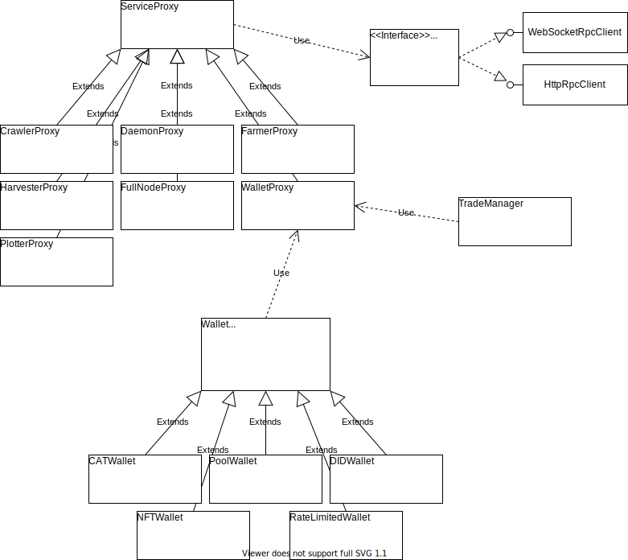

# chia-dotnet

Cross-platform .Net Core [rpc client library](https://github.com/dkackman/chia-dotnet) for [chia](https://chia.net).

_Browse the [api documentation](https://dkackman.github.io/chia-dotnet/api/chia.dotnet.html) and
[integration test code](https://github.com/dkackman/chia-dotnet/tree/main/src/chia-dotnet.tests) for more info and examples._

## Quick Start Examples

### Connect to the Node and find out about the blockchain

```csharp
var endpoint = Config.Open().GetEndpoint("daemon");
using var rpcClient = new WebSocketRpcClient(endpoint);
await rpcClient.Connect();

var daemon = new DaemonProxy(rpcClient, "unit_tests");
await daemon.RegisterService();

var fullNode = new FullNodeProxy(rpcClient, "unit_tests");
var state = await fullNode.GetBlockchainState();
Console.WriteLine($"This node is synced: {state.Sync.Synced}");
```

### Send me some chia

```csharp
var endpoint = Config.Open().GetEndpoint("wallet");
using var rpcClient = new HttpRpcClient(endpoint);

var wallet = new WalletProxy(rpcClient, "unit_tests");
await wallet.WaitForSync();

// walletId of 1 is the main XCH wallet
var standardWallet = new Wallet(1, wallet);

// this is my receive address. feel free to run this code on mainnet as often as you like :-)
var transaction = await standardWallet.SendTransaction("xch1ls2w9l2tksmp8u3a8xewhn86na3fjhxq79gnsccxr0v3rpa5ejcsuugha7", 1, 1);
```

### Listen for events

```csharp
using chia.dotnet;

var endpoint = Config.Open().GetEndpoint("daemon");
using var rpcClient = new WebSocketRpcClient(endpoint);
await rpcClient.Connect();

var daemon = new DaemonProxy(rpcClient, "eventing_testharness");
// this listens for the messages sent to the ui
await daemon.RegisterService("wallet_ui"); 
daemon.StateChanged += (sender, data) => Console.WriteLine($"daemon state change: {data}");

var farmer = daemon.CreateProxyFrom<FarmerProxy>();
farmer.ConnectionAdded += (sender, data) => Console.WriteLine($"Connection added: {data}");
farmer.NewFarmingInfo += (sender, data) => Console.WriteLine($"Farming info: {data}");
farmer.NewSignagePoint += (sender, data) => Console.WriteLine($"Signage point: {data}");

while (true)
{
    await Task.Delay(100);
}
```

### Main Types and Relationships

The Wallet service API is segmented into classes for specific wallet types and a trade manager for trades and offers.


